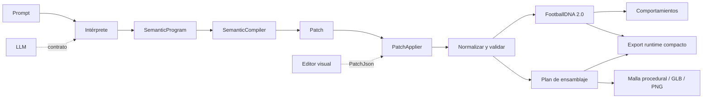

# FS27 Creator Engine

Estado: **fase "Intelligence" completada y probada fuera de Unity** (C# puro, `dotnet test Tests/Core.Tests`: 1253 pruebas, 0 fallos). **Nada de esto se ha ejecutado dentro del editor de Unity**, ningún modelo de lenguaje real se ha conectado y no existe arte final: ver la sección 5.

> El Creator Engine es de FS27. No depende de Quaternius, de Ready Player Me, de ningún creador de avatares externo ni de ningún proveedor de IA. Un modelo de lenguaje es **un intérprete más**, intercambiable, que produce datos; el motor funciona entero sin él.

## 1. Qué hace

Una persona (o un editor, o un modelo) describe un jugador con palabras y el motor lo convierte en **datos validados**: apariencia + tendencias futbolísticas + comportamientos, más un plan para construir y mostrar al personaje. Esos datos se unen al `PlayerDefinition` y al `PlayerPlayingProfile` ya existentes.

```
 Prompt (ES/EN, editor, modelo)
   │
   ▼  1. Interpretación            ISemanticInterpreter ── SemanticParser (offline) | LlmSemanticInterpreter (contrato)
 SemanticProgram  (intención, objetivo, operación, magnitud, negación, contexto, relaciones, restricciones)
   │
   ▼  2. Compilación               SemanticCompiler (determinista, compartido por todos los intérpretes)
 CharacterSpecificationPatch  + conflictos + no soportado + preguntas + InterpretationReport
   │
   ▼  3. Aplicación                PatchApplier (incremental, con deshacer)         ◄── editor visual (PatchJson)
 AuthoringDraft (CharacterSpecification + deseos de atributos/perfil/portero)
   │
   ▼  4. Coherencia y validación   AppearanceNormalizer · CharacterSpecificationValidator · FootballDNAValidator
   ▼  5. FootballDNA 2.0           FootballDnaComposer (roles + perfil + atributos + observaciones + manual)
   ▼  6. Comportamientos           BehaviorDecisionEngine (candidatos por situación)
   ▼  7. Plan de ensamblaje        CharacterAssemblyPlanner ─► ProceduralMeshBuilder ─► GLB / PNG (maniquí)
   ▼  8. Movimiento y animación    MovementSignature · MovementPersonality · CatalogAnimationResolver
   ▼  9. Exportación               RuntimeCharacterJson (compacto, ids estables)  |  AuthoringCharacterRecord (completo)
 CreatorResult { Success, Specification, Errors, Warnings, Conflicts, DebugReport, RuntimeData, AuthoringData, GenerationPlan }
```

Un solo paso lo ejecuta todo: `CreatorPipeline.Run(new CreatorRequest { Text = "..." })`. `Success` es `true` **solo** si salió una especificación válida y no queda nada sin resolver.



## 2. Reglas que no se rompen

- **La IA produce datos, nunca código.** `Prompt → datos estructurados → validación → sistemas conocidos`. Nada ejecuta texto del usuario ni la salida de un modelo (hay pruebas por reflexión y por escaneo de fuentes).
- **Coste cero en el núcleo:** sin API de pago, sin claves, sin internet ni LLM obligatorios. El `OfflineTransport` es el valor por defecto.
- **El sprint solo existe por la intensidad del joystick.** `PlayerIntent` no tiene bool, ni estilo, ni acción "sprint" (prueba en `InputCoreTests`).
- **La dificultad nunca toca atributos, overall ni DNA.** `Difficulty/*` no conoce ningún tipo del Creator (prueba de escaneo).
- **La apariencia y la animación nunca cambian cómo se mueve un jugador.** `PlayerLocomotion`, `PlayerStats`, `MovementTuning`, `StaminaSystem` y `PlayerRuntimeState` no pueden mencionar `FootballDNA`, `MovementPersonality`, `AnimationPlan`... (prueba de escaneo).
- **Universo ficticio:** nada de clubes, jugadores ni parecidos reales; las observaciones de investigación usan ids de referencia opacos, jamás nombres.
- **Determinismo:** misma entrada + misma semilla = mismo resultado, byte a byte. El motor no lee el reloj ni usa azar sin semilla (prueba de escaneo).
- **`PlayerCardData` sigue siendo una vista**; `CharacterCardView` es otra vista de solo lectura, nada depende de ellas.

## 3. Mapa de código (`Assets/_Project/Scripts/Core/Creator`, 48 archivos, C# puro sin Unity)

| Área | Archivos principales |
|---|---|
| Capa semántica | `SemanticModel`, `MagnitudeEngine`, `ConceptCatalog`, `LanguagePack(+Es/En)`, `SemanticParser`, `SemanticCompiler`, `ConflictModel` |
| Edición | `CharacterPatch` (parche, aplicador, diff/inverso), `PatchJson`, `AuthoringSession` |
| Especificación | `CharacterSpecification(+Json,+Validator)`, `ParameterCatalog`, `AppearanceCatalog`, `AppearanceCompatibility`, `StyleSystem`, `StylePresets` |
| Fútbol | `FootballDna` (v2), `BehaviorEngine`, `Observations`, `FootballDnaComposer`, `ResearchPipeline`, `IntentAssist` |
| Generación | `AssemblyPlan`, `ProceduralGeometry` (malla, GLB, rasterizador, PNG), `CharacterVariation`, `ContentCatalogs` |
| Animación | `AnimationModel`, `AnimationResolver` |
| Producto | `CreatorPipeline` (+resultado, informe, validador de contenido), `RuntimeExport`, `CharacterCardView` |
| Modelos de lenguaje | `Providers/` (`LlmContracts`, `WireFormats`, `SemanticProgramJson`, `PromptTemplates`, `LlmSemanticInterpreter`) |
| Unity (no verificado) | `Assets/_Project/Scripts/Gameplay/Creator/` |

Documentos de cada parte: [SEMANTIC_PROMPT_ENGINE](SEMANTIC_PROMPT_ENGINE.md) · [FOOTBALL_DNA](FOOTBALL_DNA.md) · [BEHAVIOR_ENGINE](BEHAVIOR_ENGINE.md) · [CHARACTER_GENERATION](CHARACTER_GENERATION.md) · [ANIMATION_ARCHITECTURE](ANIMATION_ARCHITECTURE.md) · [AUTHORING_PIPELINE](AUTHORING_PIPELINE.md) · [RUNTIME_PIPELINE](RUNTIME_PIPELINE.md) · [RESEARCH_PIPELINE](RESEARCH_PIPELINE.md) · [CREATOR_ROADMAP](CREATOR_ROADMAP.md). Anteriores que siguen vigentes: [CHARACTER_SPECIFICATION](CHARACTER_SPECIFICATION.md), [CHARACTER_RUNTIME](CHARACTER_RUNTIME.md).

## 4. Ejemplo real

```csharp
var pipeline = CreatorPipeline.CreateDefault();
CreatorResult r = pipeline.Run(new CreatorRequest {
    Text = "Crea un portero muy alto, ágil, con buenos reflejos, estiradas espectaculares y buen juego con los pies, seguro y tranquilo",
    WantPreviewPng = true, WantGlb = true });
// r.Success, r.Specification, r.Goalkeeper (GoalkeeperProfile sugerido), r.AttributeHints, r.BehaviorPreview,
// r.GenerationPlan (proporciones, firma de movimiento, animaciones de muestra), r.RuntimeData.Json (~1.1 KB), r.DebugReport
```

Muestras generadas por el propio motor (maniquí procedural, **no arte final**): [Docs/previews](previews). Se versionan los `.debug.txt` y `.runtime.json`; los `.png` y `.glb` (el repo los guarda en Git LFS) se regeneran con `dotnet run --project Tools/PreviewWriter`.

## 5. Qué es real, qué es contrato, qué necesita otras cosas

| | Estado |
|---|---|
| Parser semántico, compilador, conflictos, parches, sesión con deshacer, DNA 2.0, motor de comportamiento, composición, observaciones, investigación offline, plan de ensamblaje, malla procedural, GLB, PNG, animación (selección), exportación | **Código real, probado con `dotnet test`** |
| Capa de Unity (`Gameplay/Creator`) | **Escrita sin Unity; solo comprobada contra un stub (`Tests/UnityLayerCheck`). No compilada ni ejecutada en Unity.** |
| Modelos de lenguaje (Claude, Gemini, OpenAI, local) | **Contratos y formatos de petición/respuesta, con transporte falso en pruebas. Nunca se ha enviado una petición a un servicio real.** El de Claude sigue la documentación oficial de salida estructurada; los otros tres están ⚠️ NO VERIFICADOS. |
| Geometría 3D generada | **Real pero de calidad maniquí**: proporciones y colores correctos, formas simples, sin rig, sin animar. |
| Animaciones | **Cero clips.** Hay perfiles, etiquetas y un selector; todo está `Planned`. |
| Arte final (cara, pelo, ropa, botas reales) | **No existe.** Las partes de tipo `Asset` son la costura para cuando existan. |

## 6. Evaluación por área (sin porcentajes inventados)

| Área | Nivel | Por qué |
|---|---|---|
| A. Inteligencia semántica | **FUNCTIONAL** | Entiende negación, magnitud, contraste, contexto, referencias y preservación en ES/EN, offline; limitada a su vocabulario y sin compararla con un LLM real |
| B. Especificación del personaje | **FUNCTIONAL** | Esquema v2, migración v1→v2, validación, ida y vuelta exacta; sin uso aún dentro de Unity |
| C. Sistema de apariencia | **PARTIAL** | Parámetros, reglas de coherencia y 4 estilos reales; sin arte, sin blend shapes |
| D. FootballDNA | **FUNCTIONAL** | Datos v2, validación, composición determinista y explicable; no se ejecuta aún en partido |
| E. Motor de comportamiento | **PARTIAL** | Análisis de contexto y decisión reales y probadas; ningún comportamiento está `Implemented` ni conectado a la IA de partido |
| F. Investigación | **PARTIAL** | Análisis estadístico offline real; fuentes externas solo como contrato |
| G. Generación de personajes | **PARTIAL** | Malla procedural real + GLB + vista previa; calidad maniquí |
| H. Animación | **FOUNDATION** | Catálogo y selector reales; ningún clip |
| I. Integración con movimiento | **FOUNDATION** | Firma y personalidad de movimiento (solo presentación) + adaptador de Unity sin verificar |
| J. Integración con la IA | **FOUNDATION** | `PlayerIntent` extendido y resolutor de acciones listos; la IA de partido aún no los usa |
| K. Optimización de runtime | **PARTIAL** | Registros compactos con ids estables; 5000 personajes en ~0,55 s y ~1,1–1,7 KB c/u; sin medir en dispositivo |
| L. Pipeline de autoría | **FUNCTIONAL** | Sesión multi-turno, parches, deshacer, informes; sin interfaz visual |
